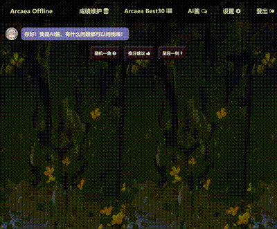

<h1 align="center">Arcaea Offline</h1>

**As I always said, if you don't like it, don't play.    —— Guy**

## Arcaea Offline 支持功能

- [x] 成绩维护
- [x] Best 30生成
- [x] AI酱复活（随机歌曲，推分建议，音游圣经）
- [x] 一键更新新版本曲目信息
- [ ] 个性化设置（B30分表样式，头像）
- [ ] 歌曲数据备份与恢复 

### Best 30

### 歌曲成绩维护

### AI酱对话

## 快速部署

1. `git clone https://github.com/DinorexTim/ArcaeaOffline.git`
2. `pip install -r requirements.txt`安装依赖

3. 运行`init.py`，完成初始化（包括曲目列表、定数信息、曲绘、搭档头像的爬取以及本地数据库的创建）

4. 运行`start.py`，启动本地服务器

5. 使用浏览器访问`http://localhost:5000`

## 常见问题

- Q: 如何更新新版本曲目信息？
    - A：运行`init.py`重新爬取歌曲信息，完成更新
- Q：为什么维护成绩界面**只加载了100首歌**的信息？
    - A：可以修改`.env`文件中的`MAX_SONG_LOADED`值（默认为100是为了防止一次性加载过多导致网页卡顿）

## 数据源

- [Arcaea 中文维基](https://arcwiki.mcd.blue)
    - `chartconstant.json`: [https://arcwiki.mcd.blue/index.php?title=Template:ChartConstant.json&action=edit'](https://arcwiki.mcd.blue/index.php?title=Template:ChartConstant.json&action=edit')
    - `songlist.json`: [https://arcwiki.mcd.blue/index.php?title=Template:Songlist.json&action=edit](https://arcwiki.mcd.blue/index.php?title=Template:Songlist.json&action=edit)
    - 曲绘: [https://arcwiki.mcd.blue/%E5%AE%9A%E6%95%B0%E8%A1%A8](https://arcwiki.mcd.blue/%E5%AE%9A%E6%95%B0%E8%A1%A8)
    - 搭档头像: [https://arcwiki.mcd.blue/%E6%90%AD%E6%A1%A3](https://arcwiki.mcd.blue/%E6%90%AD%E6%A1%A3)

## 免责声明

- 本项目中的图片来自互联网，仅供学习、分享和交流使用，所有版权归原作者所有
